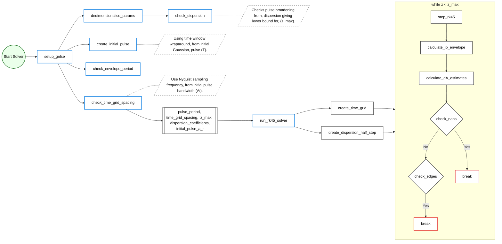

```mermaid
flowchart LR
  %% ------------------------------------------------------------
  %% Execution flow (replicated from diagram)
  %% ------------------------------------------------------------

  %% Left / setup pipeline
  start((Start Solver)):::start
  setup[setup_gnlse]:::proc

  start --> setup

  setup --> dedim[dedimensionalise_params]:::proc
  setup --> initpulse[create_initial_pulse]:::proc
  setup --> checkenv[check_envelope_period]:::proc
  setup --> checkdt[check_time_grid_spacing]:::proc

  initpulse -.- note_wrap[/"Using time window wraparound, from initial Gaussian, pulse (T)."/]:::note
  checkdt -.- note_nyq[/"Use Nyquist sampling frequency, from initial pulse bandwidth (Δt)."/]:::note

  dedim --> checkdisp[check_dispersion]:::proc
  checkdisp -.- note_zmax[/"Checks pulse broadening from, dispersion giving lower bound for, (z_max)."/]:::note_zmax

  %% Bundle of values passed onward (as per central label in figure)
  checkdt --> args[["pulse_period, time_grid_spacing,  z_max,  dispersion_coefficients, initial_pulse_a_t"]]:::bundle

  %% Right / solver
  args --> run[run_rk45_solver]:::proc

  run --> tgrid[create_time_grid]:::proc2
  run --> disphalf[create_dispersion_half_step]:::proc2

  %% Main loop subgraph
  subgraph loop["while z < z_max"]
    direction TB
    step[step_rk45]:::proc2
    ipenv[calculate_ip_envelope]:::proc2
    dA[calculate_dA_estimates]:::proc2

    step --> ipenv --> dA

    dA --> nan?{check_nans}:::decision
    nan? -->|No| edges?{check_edges}:::decision

    nan? -->|Yes| break1[break]:::break
    edges? -->|Yes| break2[break]:::break
  end

  disphalf --> loop
  tgrid --> loop

  %% ------------------------------------------------------------
  %% Styling
  %% ------------------------------------------------------------
  classDef start fill:#eaffea,stroke:#2e7d32,stroke-width:2px,color:#000;
  classDef proc  fill:#ffffff,stroke:#1e88e5,stroke-width:2px,color:#000;
  classDef proc2 fill:#ffffff,stroke:#444,stroke-width:1.5px,color:#000;
  classDef decision fill:#ffffff,stroke:#444,stroke-width:1.5px,color:#000;
  classDef break fill:#ffffff,stroke:#e53935,stroke-width:2px,color:#000;
  classDef note fill:#ffffff,stroke:#666,stroke-dasharray: 4 4,color:#000;
  classDef note_zmax fill:#ffffff,stroke:#666,stroke-dasharray: 4 4,color:#000;
  classDef bundle fill:#ffffff,stroke:#666,stroke-width:1px,color:#000;
```